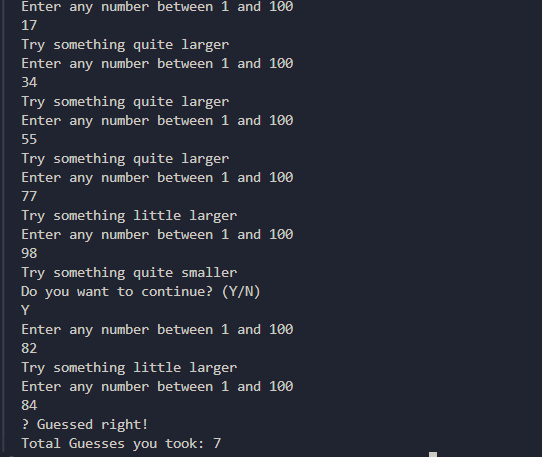

🎲 Guess the Number (Java CLI Game)
A logic-based Command Line Interface (CLI) game where the player competes against the computer to guess a randomly generated number. This project focuses on robust input validation and custom exception handling in Java.

🚀 Features
Smart Hints: Provides proximity-based feedback (e.g., "try something a little larger" vs. "try something quite larger") to guide the player.

Custom Exception Handling: Implements a specialized NotValidException class to catch and manage out-of-bounds inputs (numbers not between 1-100).   

Session Control: Includes a prompt every 5 guesses asking the user if they wish to continue or exit, managing game state effectively.   

Clean OOP Structure: Separates game logic (Game.java) from the executable entry point (GuessTheNumber.java).   

🛠️ Concepts Demonstrated

Classes & Objects: Modular design separating the Game engine from the Player interface.   

Error Handling: Use of try-catch blocks and custom Exception subclasses.   

I/O Streams: Efficiently reading user input using BufferedReader and InputStreamReader.   

Control Flow: Implementation of while loops, nested conditionals, and system exits.   

🎮 How to Play

Run the application: Execute GuessTheNumber.java.   

Input: Enter a number between 1 and 100 when prompted.   

Feedback: * If you are within 7 units of the target, the game suggests a "little" change.   

If you are further than 8 units away, it suggests a "quite" large change.   

Win: The game ends when you guess the correct number, displaying your total attempt count.
